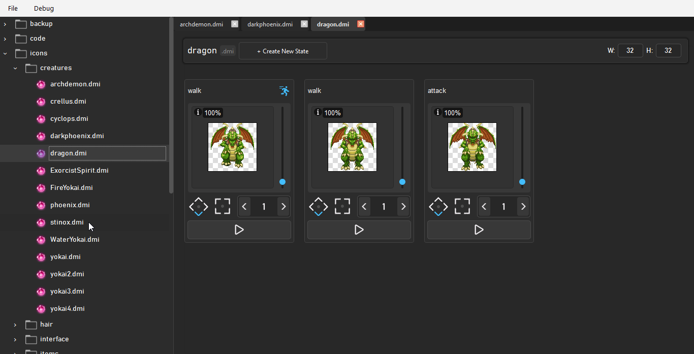

# Dream Forge  

**Dream Forge** is an experimental IDE that aims to unify 2D game development workflows under one roof.  

Instead of juggling separate editors for images, levels, and code, Dream Forge provides a **single workspace** with support for editing, asset management, and cross-framework compatibility.  

The Source Code used to be open-sourced, but now I've privatized it since I do think it has potential to be a valuable product in the near future. Still, for recruiters, I would love to showcase one of my passion projects via this README.

---
## 🎮 What It Does  

- **Image Editing**  
  Integrated sprite and tile editing with support for popular formats (PNG, JPEG, and platform specific image formats).  

- **Level Editing**  
  Scene and tilemap editing with entity/trigger placement.  

- **Code Editing with IntelliSense**  
  Built-in editor for scripts with smart autocompletion and syntax highlighting.  

- **Cross-Framework Compatibility**  
  Import and export levels, assets, and projects between popular 2D engines.  
  Example: Move a level from Framework A to Framework B without starting over.  

- **Unified Asset Management**  
  Organize sprites, audio, scripts, and levels in one place. Dream Forge handles format conversions where possible.  

---

## 🖼️ Showcase  
> ⚠️ **Note:** All demo GIFs below are clickable.  
> Clicking a GIF will download and play the corresponding **MP4 video** for smoother viewing.  

-   
- 

-   
-   

---

## ⚙️ Tech Stack  

Dream Forge is built using a combination of **systems programming and modern UI design**:

- **C** → Core backend logic and parsers  
- **C++ with Qt** → Cross-platform user interface  
- **Python & Bash** → Testing, automation, and developer tooling  

**Libraries:**  
- [Qt](https://www.qt.io/) – cross-platform app framework  
- [libpng](http://www.libpng.org/pub/png/libpng.html) – image decoding/encoding  

---

## 🚀 Goals  

- Break down silos between different 2D engines  
- Let developers **focus on games, not tools**  
- Make assets and levels **portable across frameworks**  

---

## 🛠️ Roadmap  

- [ ] Core IDE (file system, UI layout)  
- [ ] Integrated image/sprite editor  
- [ ] Tile/level editor with entities and triggers  
- [ ] IntelliSense-enabled code editor  
- [ ] Framework compatibility modules  
- [ ] Plugin system for extending support  

---

## 🌍 Planned Framework Support  

Dream Forge is designed to work across multiple engines. Planned initial targets include:  

- **Godot** – scene + resource import/export  
- **LÖVE (Love2D)** – asset + Lua code integration  
- **Phaser** – tilemaps + JavaScript pipelines  
- **BYOND** – DMI, DME, and DM parsing support.
- **RPG Maker** – map and event conversions  

> The long-term vision is to make frameworks interchangeable for assets and level designs. I believe that the initial goal of at least making it such that all resources (images, sounds, etc) that are used for a single framework will be transferrable to the next. This will dramatically reduce the amount of time needed to port games.

> An even longer term goal, which I hope to share in the future, would be to train LLMs to also transfer from one syntax to the others in cases where an engine uses a proprietary language.

---

## 📦 Status  

Dream Forge is in **active development**.  
The source code is currently private, but progress updates, screenshots, and demos will be posted here.  

---

## 📖 Documentation & Code Samples  

More detailed documentation, including **code samples and tutorials**, will be available on the [Dream Forge GitHub Pages site](https://your-username.github.io/dream-forge/) (coming soon).  

---

## 📜 License  

Currently closed-source under development.  
Future licensing will be announced.  
